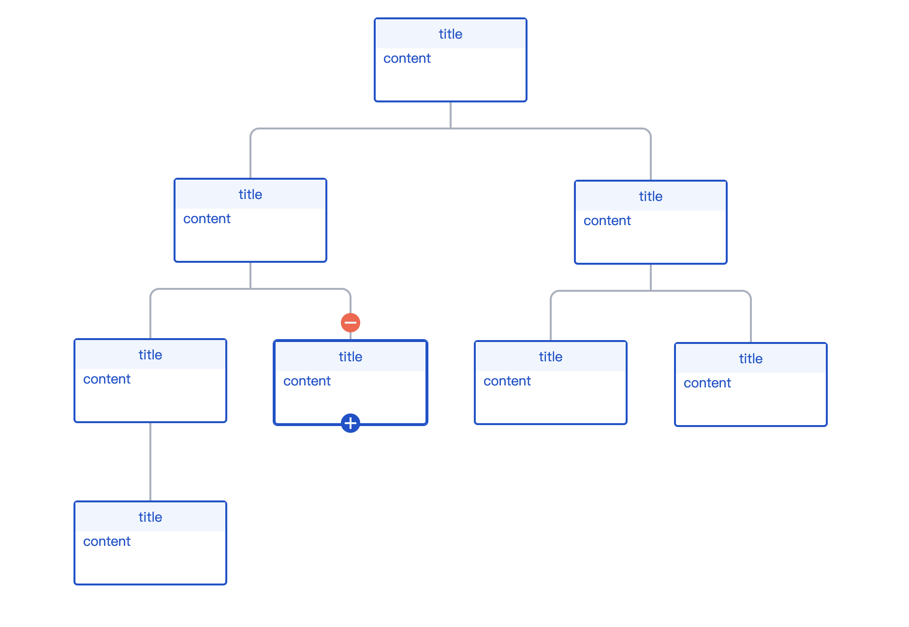

# REACT-TREE

## 介绍

react技术栈上的树形组件，支持节点新增、删除等功能，配合传入事件能满足大部分场景。

## 安装方式

```bash
npm i @weizx/react-tree
```

## 使用方式

```javascript
import { Tree, useTree } from '@weizx/react-tree';

const props = {
    tree,
    onTreeNodeClick,
    treeNodeClassName,
    treeNodeStyle
};

...
    return (
        <>
            <Tree {...props} />
        </Tree>
    );

```

```javascript
const { tree, searchNode, insertNode, updateNode, deleteNode } = useTree();

// 数据源
console.log(tree);

// 查找节点
const node = searchNode(nodeId);

// 新增节点
insertNode(parentNodeId);

// 更新节点
updateNode(nodeId);

// 删除节点
deleteNode(nodeId);
```

## API

### Tree

| 参数              | 说明                    | 类型                                    | 默认值    |
| ----------------- | ----------------------- | --------------------------------------- | --------- |
| tree              | 数据源                  | object\|undefined                       | -         |
| onTreeNodeClick   | 节点click事件的回调     | ((node: TreeNode) => void)\|undefined   | () => {}  |
| treeNodeClassName | 节点类名                | string\|undefined                       | ''        |
| treeNodeStyle     | 节点样式                | CSSProperties\|undefined                | {}        |
| insertNodeClick   | 新增节点click事件的回调 | (() => boolean)\|undefined              | undefined |
| deleteNodeClick   | 删除节点click事件的回调 | ((node: TreeNode) =>boolean)\|undefined | undefined |

## DEMO
